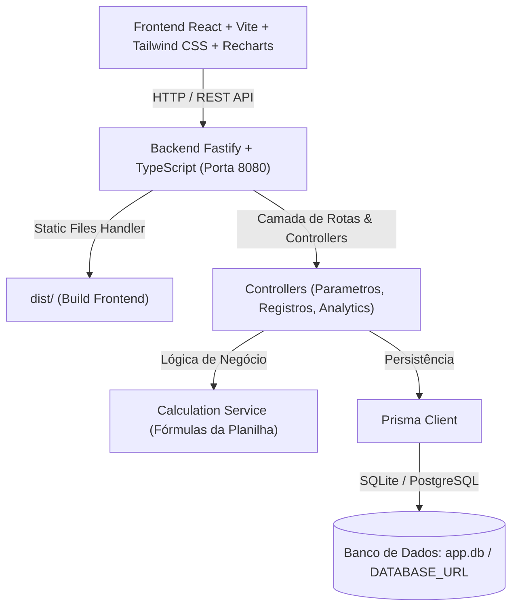

# Plano de Implementação: Boilerplate Fullstack (Oportunidades de Automação)

Este projeto inicializa uma aplicação Fullstack em **TypeScript** com arquitetura em camadas para levantamento, parametrização e análise de oportunidades de automação de processos (RPA), replicando fidedignamente os modelos matemáticos da planilha analítica `docs/Oportunidades-de-Automação.xlsx`.

---

## 1. Arquitetura Geral do Sistema



---

## 2. Estrutura de Pastas Proposta

```
.
├── prisma/
│   ├── schema.prisma            # Modelos Parametro e Registro
│   └── seed.ts                  # Seed inicial dos parâmetros padrão e registros exemplo
├── src/
│   ├── server/                  # Backend em Fastify + TS
│   │   ├── controllers/
│   │   │   ├── parametro.controller.ts
│   │   │   ├── registro.controller.ts
│   │   │   └── analytics.controller.ts
│   │   ├── services/
│   │   │   ├── parametro.service.ts
│   │   │   ├── registro.service.ts
│   │   │   ├── calculation.service.ts   # Cálculo exato das fórmulas da planilha
│   │   │   └── analytics.service.ts     # Agregações para KPIs e gráficos
│   │   ├── routes/
│   │   │   ├── parametro.routes.ts
│   │   │   ├── registro.routes.ts
│   │   │   ├── analytics.routes.ts
│   │   │   └── index.ts
│   │   ├── lib/
│   │   │   └── prisma.ts
│   │   └── index.ts             # Inicialização do Fastify e servir estáticos
│   └── client/                  # Frontend em React + Vite + Tailwind + Recharts
│       ├── src/
│       │   ├── components/
│       │   │   ├── Layout.tsx
│       │   │   ├── Navbar.tsx
│       │   │   ├── Modal.tsx
│       │   │   ├── StatCard.tsx
│       │   │   └── RegistroFormModal.tsx
│       │   ├── pages/
│       │   │   ├── DashboardPage.tsx    # KPIs, gráficos comparativos, ranking
│       │   │   ├── RegistrosPage.tsx    # CRUD interativo, filtros, busca, paginação
│       │   │   └── ParametrosPage.tsx   # Configurações globais com feedback
│       │   ├── services/
│       │   │   └── api.ts
│       │   ├── types/
│       │   │   └── index.ts
│       │   ├── App.tsx
│       │   ├── main.tsx
│       │   └── index.css
│       ├── index.html
│       ├── vite.config.ts
│       ├── tailwind.config.js
│       └── postcss.config.js
├── Dockerfile                   # Multi-stage build (Vite + Fastify + Prisma)
├── docker-compose.yml           # Serviço mapeando 8080:8080 e volume /data
├── .gitlab-ci.yml               # Pipeline com build, migrate e deploy
├── .env.example
├── .gitignore
├── tsconfig.json
├── package.json
└── README.md
```

---

## 3. Modelo de Dados (`prisma/schema.prisma`)

### Modelo `Parametro` (Singleton):
- **Pesos de Benefícios (1 a 3):**
  - `pesoAumentarCapacidade` (padrão: 2)
  - `pesoTransformacaoDigital` (padrão: 1)
  - `pesoLiberarPessoas` (padrão: 3)
  - `pesoMelhorarExpCliente` (padrão: 1)
  - `pesoReduzirCusto` (padrão: 3)
  - `pesoReduzirErros` (padrão: 2)
  - `pesoReduzirFte` (padrão: 3)
  - `pesoReduzirTempoResposta` (padrão: 2)
- **Carga Horária Base:**
  - `cargaHorariaPadrao` (padrão: 160 HH/mês)
- **Infraestrutura Robótica:**
  - `operadorSalaControle` (padrão: 4000.00)
  - `servidor` (padrão: 1150.70)
  - `licencaRobo` (padrão: 3325.00)
  - `estacaoTrabalhoRobo` (padrão: 125.00)
- **Custos por Turno e Manutenção:**
  - `percDiurno` (padrão: 0.60), `percNoturno` (padrão: 0.30), `percFimDeSemana` (padrão: 0.10)
  - `nrRobos` (padrão: 1)
  - `custoHoraDesenvolvimento` (padrão: 165.00)

### Modelo `Registro` (Processo / Oportunidade):
- **Identificação & Contexto:** `id`, `idOrigem`, `idAnalise`, `area`, `nomeProcesso`, `dataLevantamento`, `participantes`, `situacao`
- **AS IS:** `areasEnvolvidas`, `descricaoProcesso`, `numExecucoes`, `periodicidade`, `numPessoasEnvolvidas`, `tipoAlocacao`, `perfilExecutor`, `valorHoraExecutor`, `tempoExecucao`, `custoMensalAtual`, `sistemasEnvolvidos`, `documentosApoio`
- **TO BE & Benefícios (Matriz de Impacto):**
  - `benAumentarCapacidade`, `benTransformacaoDigital`, `benLiberarPessoas`, `benMelhorarExpCliente`, `benReduzirCusto`, `benReduzirErros`, `benReduzirFte`, `benReduzirTempoResposta` (`"principal"`, `"bastante"`, `"pouco"`, `"nenhum"`)
  - `pontuacaoBeneficios` (calculado)
- **TO BE Técnico & Parâmetros de Esforço:**
  - `descricaoSolucao`, `pontosAtencao`, `fteLiberado`, `reducaoTempoPrevista`, `complexidade`, `reducaoCustoPrevista`, `numRotinas`, `turno`, `recomendacao`
  - `esforcoSetupSemanas`, `horasRobo`, `horasApoioNegocio`, `horasManutencao`
- **Campos Calculados e Armazenados:**
  - `investimentoSetup`, `custoHorasRobo`, `custoHorasNegocio`, `custoManutencao`
  - `custoMensalAno1`, `custoMensalAno2`, `custoAnualAno1`, `custoAnualAno2`
  - `roiAno1`, `roiAno2`, `paybackMeses`
- **Timestamps:** `createdAt`, `updatedAt`

---

## 4. Endpoints da API RESTful

1. `GET /api/parametros` & `PUT /api/parametros`
2. `GET /api/registros`, `POST /api/registros`, `PUT /api/registros/:id`, `DELETE /api/registros/:id`
3. `GET /api/analytics/resumo` (com suporte a query params opcionais: `?registroId=...`, `?area=...`, `?situacao=...`):
   - **Visão Global ou Por Projeto/Registro Selecionado:**
     - Se nenhum ID for passado: retorna o consolidado agregado de todos os processos cadastrados.
     - Se `registroId` for informado: retorna a análise detalhada e comparativos focados no projeto selecionado em relação às médias/totais globais.
   - **KPIs:** Total de Processos, Total FTE Liberado, Economia Anual Ano 1, Economia Anual Ano 2, Payback Médio, Investimento Setup Total.
   - **Gráficos:** Distribuição por Complexidade, Comparativo AS IS vs TO BE (Custo Mensal), Distribuição por Turno, Ranking de ROI e Matriz de Priorização (Pontuação Benefícios vs ROI).

---

## 5. Frontend & Telas

1. **Dashboard:**
   - **Filtro de Escopo / Seletor:** Dropdown para alternar entre "Todos os Processos (Visão Global)" ou selecionar um projeto/processo específico da listagem.
   - Cards de métricas principais (KPIs de impacto e retorno financeiro adaptáveis ao filtro).
   - Gráfico de Custo AS IS vs TO BE por Processo (Barras).
   - Gráfico de Distribuição por Complexidade e por Turno (Pizza/Donut).
   - Tabela de Ranking das Melhores Oportunidades com badges de recomendação.
2. **Cadastros (CRUD):**
   - Tabela responsiva com busca textual, filtro por área, situação e complexidade.
   - Modal com formulário organizado em abas/etapas (Dados Gerais, AS IS, Benefícios TO BE, Custos & Esforço) com pré-visualização em tempo real dos cálculos e gravação.
3. **Configurações:**
   - Edição dos parâmetros de infraestrutura, taxas de turno, custos de desenvolvedor e pesos dos benefícios intangíveis.
   - Botão de salvar com feedback visual imediato (toast/notificação).

---

## 6. Containers & CI/CD

- **`Dockerfile` Multi-Stage:**
  - `builder-client`: Compila Vite React.
  - `builder-server`: Compila TypeScript e gera Prisma Client.
  - `runner`: Imagem final enxuta (`node:20-alpine` ou `node:22-alpine`) expondo a porta `8080`.
- **`docker-compose.yml`:**
  - Mapeamento `8080:8080`, volume de dados `/data` para persistência do SQLite `app.db`.
- **`.gitlab-ci.yml`:**
  - Estágios: `test`, `build`, `migrate` e `deploy`.
- **`.env.example`:**
  - `PORT=8080`, `NODE_ENV=production`, `DATABASE_URL="file:/data/app.db"`.

---

## 7. Plano de Verificação

### Testes Automatizados e Build:
1. `npm run build` (Client + Server): Validação de tipos TypeScript e empacotamento.
2. `npx prisma validate` & `npx prisma db push / migrate`: Validação do schema do banco.
3. Teste das fórmulas do `calculation.service.ts` com dados de teste para assegurar exata paridade com a planilha.

### Testes Manuais & Interface:
1. Inicialização da API na porta 8080 com `npm run dev`.
2. Criação, edição e exclusão de registro via UI com conferência dos campos calculados.
3. Alteração de parâmetros globais e visualização no Dashboard.

---

> [!NOTE]
> Conforme as diretrizes do projeto e regras globais, este plano aguarda sua aprovação explícita antes de iniciar a escrita dos códigos e instalação de pacotes.
